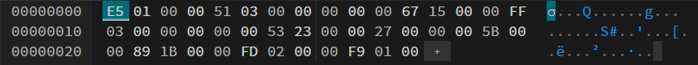

# Ассемблер и интерпретатор для учебной виртуальной машины (УВМ)

Этот проект реализует ассемблер и интерпретатор для **учебной виртуальной машины (УВМ)**. УВМ обрабатывает заранее определённый набор инструкций, позволяя эффективно собирать, исполнять и тестировать программы. Система предназначена для учебных целей и демонстрирует основные принципы низкоуровневого программирования и работы виртуальных машин.

---

## Возможности

### Ассемблер
- Преобразует человеко-читаемые инструкции ассемблера в бинарный формат.
- Создаёт файл лога в формате JSON, содержащий детали собранных инструкций.

### Интерпретатор
- Исполняет бинарную программу на УВМ.
- Сохраняет значения памяти в указанных диапазонах в файл результата в формате JSON.

### Интерфейс командной строки
- Поддерживает указание путей к входным/выходным файлам, логу и параметрам диапазона памяти.

### Поддерживаемые инструкции
Реализованы следующие команды УВМ:

1. **Загрузка константы**
   - Код операции: `5`
   - Описание: Загружает константное значение в адрес памяти.
   - Размер инструкции: 11 байт.

2. **Чтение из памяти**
   - Код операции: `7`
   - Описание: Читает значение из одного адреса памяти и записывает в другой.
   - Размер инструкции: 11 байт.

3. **Запись в память**
   - Код операции: `3`
   - Описание: Записывает значение из одного адреса памяти в другой с учетом смещения.
   - Размер инструкции: 11 байт.

4. **Побитовое исключающее "ИЛИ"**
   - Код операции: `9`
   - Описание: Выполняет побитовое исключающее "ИЛИ" значений из двух адресов памяти и записывает результат в целевой адрес.
   - Размер инструкции: 11 байт.

---

## Установка и настройка

### Клонирование репозитория
```bash
git clone https://github.com/AleksUon/Configuration-management-4
cd Configuration-management-4
```

### Создание и активация виртуального окружения
#### Windows
```bash
python -m venv venv
.\venv\Scripts\activate
```
#### Linux/Unix/MacOS
```bash
python -m venv venv
source venv/bin/activate
```

---

## Использование

### Ассемблирование
Преобразует исходный файл ассемблера в бинарный файл и генерирует файл лога.
```bash
python main.py assemble <input.txt> <output.bin> --log_file <log.json>
```

### Интерпретация
Исполняет бинарную программу и сохраняет значения памяти в указанном диапазоне в файл результата.
```bash
python main.py interpret <output.bin> <result.json> --memory_range <start:end>
```

---

## Формат инструкций

### Загрузка константы
- **Код операции**: 5
- **Размер**: 11 байт
- **Описание**: Загружает константу в память.
- **Пример**:
  - Входные данные: `A=5, B=30, C=849`
  - Бинарный код: `0xE5, 0x01, 0x00, 0x80, 0xA8, 0x01, 0x00, 0x00, 0x00, 0x00, 0x00`

### Чтение из памяти
- **Код операции**: 7
- **Размер**: 11 байт
- **Описание**: Читает значение из адреса памяти `C` и записывает в адрес `B`.
- **Пример**:
  - Входные данные: `A=7, B=342, C=1023`
  - Бинарный код: `0x67, 0x15, 0x00, 0x80, 0xFF, 0x01, 0x00, 0x00, 0x00, 0x00, 0x00`

### Запись в память
- **Код операции**: 3
- **Размер**: 11 байт
- **Описание**: Записывает значение в адрес, вычисленный как `B + C`.
- **Пример**:
  - Входные данные: `A=3, B=565, C=39, D=91`
  - Бинарный код: `0x53, 0x23, 0x00, 0x80, 0x93, 0x2D, 0x00, 0x00, 0x00, 0x00, 0x00`

### Побитовое исключающее "ИЛИ"
- **Код операции**: 9
- **Размер**: 11 байт
- **Описание**: Выполняет XOR значений из адресов `C` и `D` и записывает результат в адрес `B`.
- **Пример**:
  - Входные данные: `A=9, B=440, C=765, D=505`
  - Бинарный код: `0x89, 0x1B, 0x00, 0x80, 0x7E, 0x01, 0x00, 0xE4, 0x07, 0x00, 0x00`

---

## Пример работы

### Входной файл ассемблера
```assembly
A=5, B=30, C=849
A=7, B=342, C=1023
A=3, B=565, C=39, D=91
A=9, B=440, C=765, D=505
```

### Команды
```bash 
python main.py assemble input.txt output.bin --log_file log.json
python main.py interpret output.bin result.json --memory_range 0:64
```

### Файл результата (`outputs.json`)



### Файл результата (`log.json`)
```json
[
    {
        "A": 5,
        "B": 30,
        "C": 849,
        "D": 0,
        "result": [
            229,
            1,
            0,
            0,
            81,
            3,
            0,
            0,
            0,
            0,
            0
        ]
    },
    {
        "A": 7,
        "B": 342,
        "C": 1023,
        "D": 0,
        "result": [
            103,
            21,
            0,
            0,
            255,
            3,
            0,
            0,
            0,
            0,
            0
        ]
    },
    {
        "A": 3,
        "B": 565,
        "C": 39,
        "D": 91,
        "result": [
            83,
            35,
            0,
            0,
            39,
            0,
            0,
            0,
            91,
            0,
            0
        ]
    },
    {
        "A": 9,
        "B": 440,
        "C": 765,
        "D": 505,
        "result": [
            137,
            27,
            0,
            0,
            253,
            2,
            0,
            0,
            249,
            1,
            0
        ]
    }
]
```

